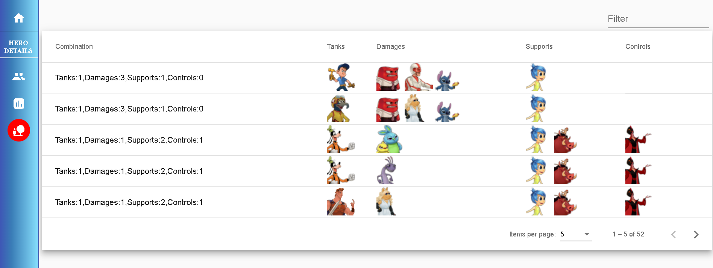

# findYourDisneyHeroes
Disney Heroes - helps to find your disney heroes 

Demo App: http://13.229.70.212:8168/disney-heroes/

## Screenshots
### Main screen

### Explore the heros

### Show most popular heroes 

### Team Statistics on selected heros

### Role Combinations on selected heros

### Popular friendships on selected heros

## Technologies
1. Angular v 8.2.14 
2. Material Design v 8.2.3 
3. ngx-Charts v 13.0.1 
4. ngx-leaflet v5.0.3 
5. nodejs v 13.5 
6. mongodb v ??? 
7. git flow

## Angular Challenges
1. Dynamic Components
2. Router navigation for out of zone
3. Redesigned using a common symbolic node_modules
4. Fixed initialising of component that depends on the completion of data loading in a service
5. Fixed resource loading in production build with aot=true 
6. Customized a readonly mat-slider
